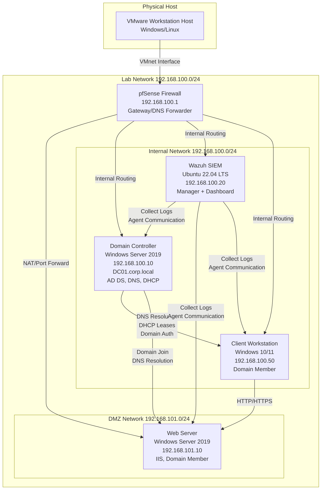
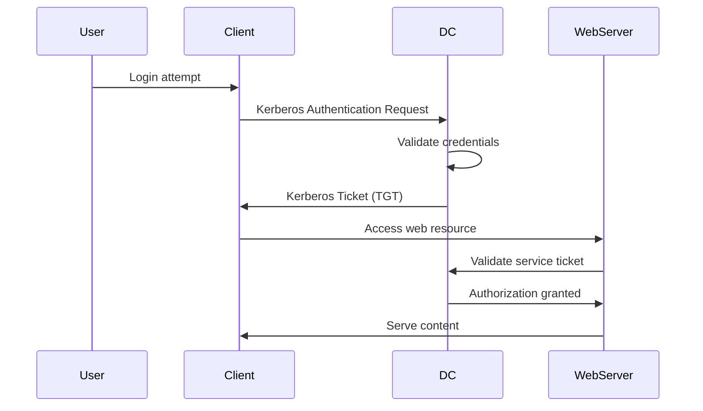
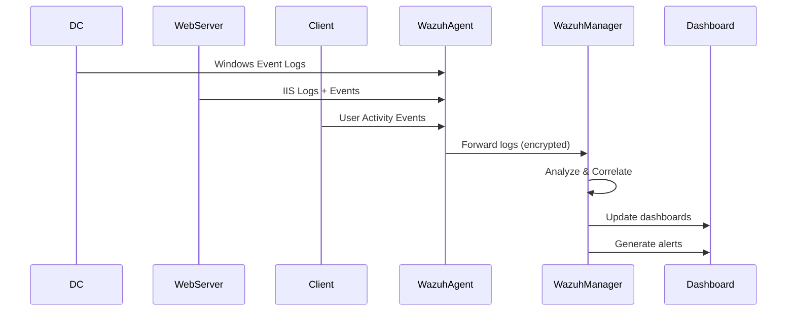
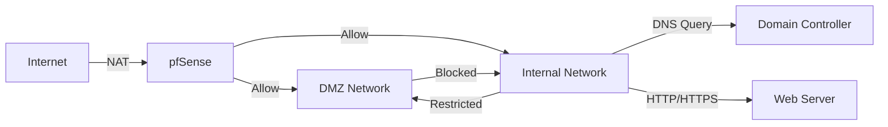

# Lab Architecture

## Overview

This document describes the architecture of the Home AD Lab environment, including component relationships, data flows, and design decisions.

## System Architecture



## Component Details

### 1. pfSense Firewall (192.168.100.1)

**Role:** Network gateway, firewall, and router

**Functions:**
- NAT translation for internet access
- Firewall rules for network segmentation
- DHCP relay (if needed)
- DNS forwarder to DC
- VPN server (optional)
- Network monitoring and logging

**Network Interfaces:**
- WAN: NAT to host network
- LAN: 192.168.100.0/24 (Internal network)
- OPT1: 192.168.101.0/24 (DMZ network)

**Key Services:**
- pfSense firewall engine
- DHCP relay
- DNS forwarder
- Logging to Wazuh (syslog)

### 2. Domain Controller (192.168.100.10)

**Role:** Active Directory Domain Services, DNS, DHCP

**FQDN:** `DC01.corp.local`

**Functions:**
- Active Directory Domain Services (AD DS)
- DNS server for corp.local
- DHCP server for internal network
- Group Policy management
- User and computer account management

**Key Services:**
- Active Directory Domain Services
- DNS Server
- DHCP Server
- File and Storage Services (optional)
- Windows Event Logging

**OU Structure:**
```
corp.local
├── Computers
│   ├── Servers
│   └── Workstations
├── Users
│   ├── IT
│   ├── Sales
│   └── Management
└── Groups
    ├── Security Groups
    └── Distribution Groups
```

### 3. Wazuh SIEM (192.168.100.20)

**Role:** Security Information and Event Management

**Functions:**
- Centralized log collection
- Security event correlation
- Threat detection and alerting
- Compliance monitoring
- Vulnerability assessment
- File integrity monitoring

**Components:**
- Wazuh Manager: Log processing and analysis
- Wazuh Dashboard: Web-based UI (Kibana)
- Wazuh Agents: Installed on Windows machines

**Data Sources:**
- Windows Event Logs (Security, System, Application)
- IIS logs
- pfSense firewall logs (syslog)
- File integrity monitoring
- Process monitoring

### 4. Web Server (192.168.101.10)

**Role:** Web application hosting in DMZ

**FQDN:** `WEB01.corp.local`

**Functions:**
- IIS web server
- Host internal web applications
- Domain member for authentication
- Logging to Wazuh

**Key Services:**
- Internet Information Services (IIS)
- ASP.NET (if needed)
- Windows Event Logging
- Wazuh Agent

**Network Placement:**
- Located in DMZ (192.168.101.0/24)
- Firewall rules restrict access
- Can be accessed from internal network
- Authenticates against AD

### 5. Client Workstation (192.168.100.50)

**Role:** End-user workstation for testing

**FQDN:** `CLIENT01.corp.local`

**Functions:**
- Domain member
- User authentication testing
- Application testing
- Security testing scenarios

**Key Services:**
- Windows 10/11 Enterprise
- Wazuh Agent
- Standard user applications

## Data Flow

### Authentication Flow



### Log Collection Flow



### Network Traffic Flow



## Design Decisions

### Network Segmentation

**Decision:** Separate DMZ from internal network

**Rationale:**
- Provides security boundary for web services
- Allows testing of firewall rules
- Simulates real-world network architecture
- Enables attack simulation scenarios

### Domain Name

**Decision:** Use `corp.local` as domain name

**Rationale:**
- `.local` is reserved for mDNS but commonly used in labs
- Short and easy to type
- Clearly indicates lab environment
- Avoids conflicts with real domains

### IP Addressing

**Decision:** Use 192.168.100.0/24 for internal, 192.168.101.0/24 for DMZ

**Rationale:**
- Private IP ranges (RFC 1918)
- Easy to remember and document
- Allows for future expansion
- Standard practice for lab environments

### SIEM Choice

**Decision:** Use Wazuh instead of Splunk or ELK

**Rationale:**
- Open-source and free
- Lightweight compared to ELK
- Good Windows integration
- Active community and documentation
- Suitable for learning and small labs

### Firewall Choice

**Decision:** Use pfSense instead of OPNsense or Sophos

**Rationale:**
- Most popular and well-documented
- Extensive feature set
- Good logging capabilities
- Free and open-source
- Large community support

## Security Considerations

### Network Isolation
- Lab network is isolated from production
- No direct internet exposure (NAT only)
- Firewall rules restrict inter-network communication

### Credential Management
- Use strong, unique passwords
- Document credentials securely (encrypted or separate file)
- Consider using password managers
- Rotate credentials periodically

### Logging and Monitoring
- All systems forward logs to Wazuh
- Centralized monitoring of security events
- Alerting on suspicious activities
- Regular log review

### Updates and Maintenance
- Keep all VMs updated
- Regular security patches
- Monitor for vulnerabilities
- Backup configurations

## Scalability

This architecture can be extended with:
- Additional domain controllers (redundancy)
- Additional client workstations
- Vulnerable machines for penetration testing
- Additional servers (file server, mail server, etc.)
- Additional network segments
- VPN server for remote access

## Performance Considerations

### Resource Allocation
- Allocate resources based on available host hardware
- Monitor resource usage and adjust as needed
- Consider running VMs on separate physical drives
- Use SSD storage for better performance

### Network Performance
- Use VMnet for internal communication (fast)
- NAT may introduce slight latency
- Consider dedicated network adapter for lab

### Storage
- Use thin provisioning for VMs
- Regular cleanup of logs and temp files
- Monitor disk space usage
- Consider separate disk for Wazuh logs

